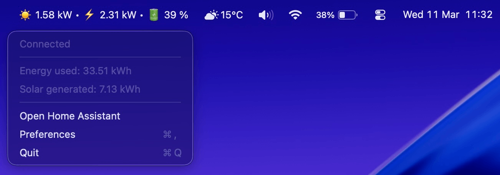

<p align="center">
  
</p>

# Peek for Home Assistant

A macOS menu bar app for monitoring Home Assistant sensors without opening a browser.

<p align="center"></p>

## Features

- **Menu bar display** - Show selected sensors directly in the menu bar with customizable format and separators
- **Dropdown menu** - Show additional sensors in the dropdown menu
- **Real-time updates** - Live sensor values via WebSocket with automatic reconnection
- **Custom naming** - Override sensor names for a more personalized display
- **Configurable formatting** - Templates for how sensor values appear (e.g., `{name}: {value}`)
- **Drag & drop** - Reorder sensors and move them between menu bar and dropdown
- **Auto-update** - Background update checks with one-click install
- **Lightweight** - Built with Tauri 2.0 for a small footprint and native performance

## Install

Download the latest `.dmg` from [GitHub Releases](https://github.com/tiagonoronha/peek/releases).

Requires **macOS 11+** and a Home Assistant instance with a [long-lived access token](https://developers.home-assistant.io/docs/auth_api/#long-lived-access-token).

## Setup

1. Click the Peek icon in the menu bar and open **Preferences**
2. Enter your Home Assistant URL and access token
3. Go to the **Sensors** tab and add the sensors you want to monitor

## Build from source

Requires [Node.js 20+](https://nodejs.org/), [Rust](https://www.rust-lang.org/tools/install), and the [Tauri CLI](https://v2.tauri.app/start/prerequisites/).

```sh
npm install
npm run dev     # development
npm run build   # production .dmg
```

## Privacy

Peek has no trackers, no analytics, and does not phone home. The only external connection it makes (besides talking to your Home Assistant instance) is checking GitHub for new versions.

## AI Disclaimer

This app is an experiment in building with AI. I wanted to see how far I could push things without manually coding everything myself.

Tauri looked interesting, so I decided to use it. Since I don't know Rust, I set a rule: the entire project had to rely on Tauri's JavaScript API as much as possible.

I guided the process closely and set the direction, but in terms of manual coding, I personally wrote only a very small portion of the code.

Make of that what you will.
